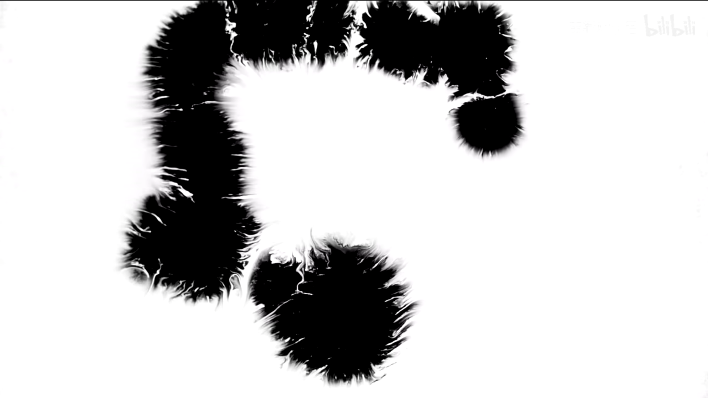
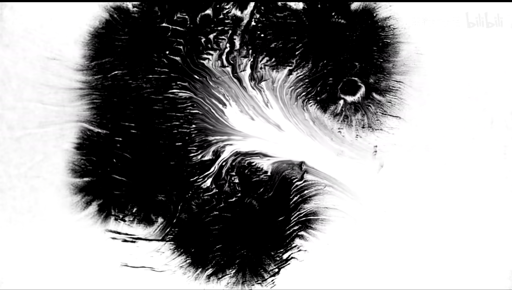
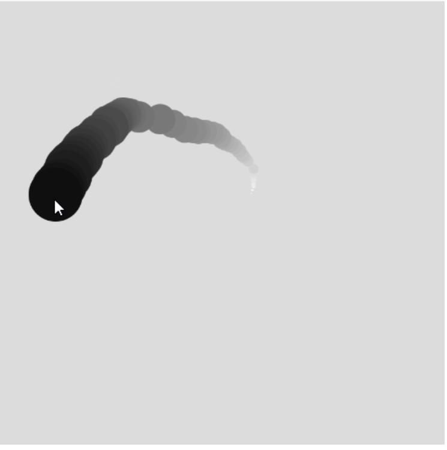

# nshe0132_9103_tut2

## Ass8

### PART 1

The technique explored in this section is Chinese ink haloing, where the entire image depicts several drops of ink spread out on rice paper. It seems to be a very simple phenomenon, but if one wants to implement it in code one will find it to be a very challenging task. Essentially a combination of line and graphic work, it will be visually beautiful and stunning.

### PART 2

I found an example of implementing the mouse as an ink brush, using an array in p5.js to achieve the ink effect. The core idea is 1. save the current mouse value as the value in the last position of the array 2. the value of the original array keeps moving forward 3. let the new mouse value squeeze out the original value. This idea can also be applied to the ink vignetting, the core is also constantly around the original position to produce new graphics and reduce transparency.

link:https://blog.csdn.net/Program_dancing/article/details/102543579?ops_request_misc=&request_id=&biz_id=102&utm_term=p5.js%E5%A2%A8%E6%B0%B4%E6%99%95%E6%9F%93&utm_medium=distribute.pc_search_result.none-task-blog-2~all~sobaiduweb~default-1-102543579.142^v94^insert_down1&spm=1018.2226.3001.4187

Also I found a way to create watercolour edges using P5.js also informative.

link：https://blog.csdn.net/cxu0262/article/details/106256907?ops_request_misc=&request_id=&biz_id=102&utm_term=p5.js%E5%A2%A8%E6%B0%B4%E6%99%95%E6%9F%93&utm_medium=distribute.pc_search_result.none-task-blog-2~all~sobaiduweb~default-2-106256907.142^v94^insert_down1&spm=1018.2226.3001.4187
